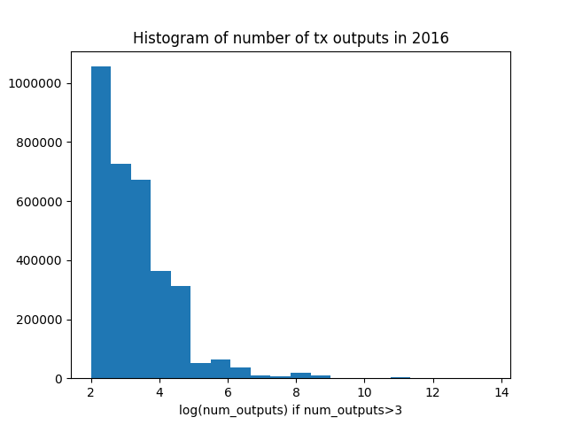
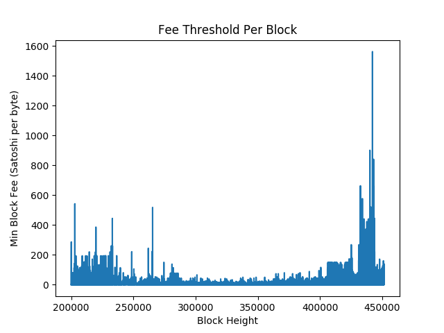

==========
Examples
==========

This section includes various examples of using the chainscan library, and
demonstrates some of the main features.

Hello, World!
================

::

    from chainscan import iter_blocks
    for block in iter_blocks():
        if block.height > 10: break
        for tx in block.txs:
            print('Hello, tx %s in block %s' % (tx, block))

Ouput::

    Hello, tx <Tx 4a5e1e4baab89f3a32518a88c31bc87f618f76673e2cc77ab2127b7afdeda33b {COINBASE}> in block <Block #0 000000000019d6689c085ae165831e934ff763ae46a2a6c172b3f1b60a8ce26f>
    Hello, tx <Tx 0e3e2357e806b6cdb1f70b54c3a3a17b6714ee1f0e68bebb44a74b1efd512098 {COINBASE}> in block <Block #1 00000000839a8e6886ab5951d76f411475428afc90947ee320161bbf18eb6048>
    Hello, tx <Tx 9b0fc92260312ce44e74ef369f5c66bbb85848f2eddd5a7a1cde251e54ccfdd5 {COINBASE}> in block <Block #2 000000006a625f06636b8bb6ac7b960a8d03705d1ace08b1a19da3fdcc99ddbd>
    Hello, tx <Tx 999e1c837c76a1b7fbb7e57baf87b309960f5ffefbf2a9b95dd890602272f644 {COINBASE}> in block <Block #3 0000000082b5015589a3fdf2d4baff403e6f0be035a5d9742c1cae6295464449>
    Hello, tx <Tx df2b060fa2e5e9c8ed5eaf6a45c13753ec8c63282b2688322eba40cd98ea067a {COINBASE}> in block <Block #4 000000004ebadb55ee9096c9a2f8880e09da59c0d68b1c228da88e48844a1485>
    Hello, tx <Tx 63522845d294ee9b0188ae5cac91bf389a0c3723f084ca1025e7d9cdfe481ce1 {COINBASE}> in block <Block #5 000000009b7262315dbf071787ad3656097b892abffd1f95a1a022f896f533fc>
    Hello, tx <Tx 20251a76e64e920e58291a30d4b212939aae976baca40e70818ceaa596fb9d37 {COINBASE}> in block <Block #6 000000003031a0e73735690c5a1ff2a4be82553b2a12b776fbd3a215dc8f778d>
    Hello, tx <Tx 8aa673bc752f2851fd645d6a0a92917e967083007d9c1684f9423b100540673f {COINBASE}> in block <Block #7 0000000071966c2b1d065fd446b1e485b2c9d9594acd2007ccbd5441cfc89444>
    Hello, tx <Tx a6f7f1c0dad0f2eb6b13c4f33de664b1b0e9f22efad5994a6d5b6086d85e85e3 {COINBASE}> in block <Block #8 00000000408c48f847aa786c2268fc3e6ec2af68e8468a34a28c61b7f1de0dc6>
    Hello, tx <Tx 0437cd7f8525ceed2324359c2d0ba26006d92d856a9c20fa0241106ee5a597c9 {COINBASE}> in block <Block #9 000000008d9dc510f23c2657fc4f67bea30078cc05a90eb89e84cc475c080805>
    Hello, tx <Tx d3ad39fa52a89997ac7381c95eeffeaf40b66af7a57e9eba144be0a175a12b11 {COINBASE}> in block <Block #10 000000002c05cc2e78923c34df87fd108b22221ac6076c18f3ade378a4d915e9>

Iterating over Blocks
================================

`tail -f blocks`
--------------------------------

Iterate over all blocks, and in the end keep waiting for new ones, printing them as they arrive::

    from chainscan import iter_blocks
    from chainscan.utils import tailable
    from datetime import datetime
    for block in tailable(iter_blocks()):
        print(datetime.now(), block.height, block.block_hash_hex)

Biggest block timestamp "discrepancy"
-------------------------------------------

Block timestamps are approximate and not necessarily in order, but what is the
biggest "discrepancy" observed?

::

    from chainscan import iter_blocks
    from datetime import timedelta
    max_ts_block = next(iter_blocks())
    max_diff_block, max_diff = None, timedelta(seconds = 0)
    for block in iter_blocks():
        diff = max_ts_block.timestamp - block.timestamp
        if diff > max_diff:
            max_diff_block, max_diff = block, diff
        if block.timestamp > max_ts_block.timestamp:
            max_ts_block = block
    print('block #%s was allegedly mined %s BEFORE a previous block' % (max_diff_block.height, max_diff))

Output::

    block #156114 was allegedly mined 1:58:45 BEFORE a previous block

Count empty blocks per day
-------------------------------

::

    from chainscan import iter_blocks
    from collections import OrderedDict
    daily_count = OrderedDict()
    for block in iter_blocks():
        if block.num_txs == 1:  # empty -- coinbase tx only
            d = block.timestamp.date()
            daily_count.setdefault(d, 0)
            daily_count[d] += 1
    for d, count in daily_count.items():
        print('%s: %d empty blocks' % (d, count))

Ouput::

    2009-01-03: 1 empty blocks
    2009-01-09: 14 empty blocks
    2009-01-10: 51 empty blocks
    2009-01-11: 97 empty blocks
    2009-01-12: 86 empty blocks
    2009-01-13: 121 empty blocks
    ...
    2009-05-09: 85 empty blocks
    2009-05-10: 71 empty blocks
    2009-05-11: 119 empty blocks
    2009-05-12: 130 empty blocks
    2009-05-13: 112 empty blocks
    ...
    2014-06-01: 1 empty blocks
    2014-06-02: 2 empty blocks
    2014-06-03: 4 empty blocks
    2014-06-04: 4 empty blocks
    2014-06-05: 1 empty blocks
    2014-06-06: 1 empty blocks
    2014-06-10: 3 empty blocks
    ...

Total number of coins
-------------------------------

The total number of minted coins is the sum of values of all coinbase txs.

::

    from chainscan import iter_blocks
    total_btc = 0
    for block in iter_blocks(show_progressbar = True):
        coinbase_tx = next(iter(block.txs))  # the first tx is coinbase
        total_btc += coinbase_tx.get_total_output_value()
    print('Total %d satoshis (up to block height %d)' % (total_btc, block.height))

Output::

    Total 1620649064333173 satoshis (up to block height 451361)

Iterating over Transactions
================================

Count tx versions
-------------------------

::

    from chainscan import iter_txs
    from collections import Counter
    print(Counter( tx.version for tx in iter_txs() ))

Output::

    Counter({0: 1,
             1: 112477708,
             2: 53,
             3: 1,
             2164260863: 1,
             2187681472: 1,
             2591798512: 1})

Total provably-unspendable coins
------------------------------------

::

    from chainscan import iter_txs
    from chainscan.defs import OP_RETURN
    from chainscan.misc import satoshi2float
    def is_unspendable(txout):
        return txout.script and txout.script[0] == OP_RETURN
    total = 0
    for tx in iter_txs(show_progressbar = True):
        for txout in tx.outputs:
            if is_unspendable(txout):
                total += txout.value
    print('%f total provably-unspendable coins' % satoshi2float(total))

Output::

    3.695161 total provably-unspendable coins

Block with highest median tx-value
-----------------------------------

Only considering blocks with at least 100 txs.

::

    from chainscan import iter_blocks
    from chainscan.misc import satoshi2float
    import numpy as np
    
    def get_median_tx_value(block):
        if block.num_txs <= 100: return 0
        tx_amounts = [ tx.get_total_output_value() for tx in block.txs if not tx.is_coinbase ]
        return np.median(tx_amounts)
    
    block = max(iter_blocks(), key = get_median_tx_value)
    print('%s with highest median tx value: %f' % (block, satoshi2float(get_median_tx_value(block))))
    
Output::

    <Block #119219 0000000000006b9c2f4f033206f04f1206f0f0fb6d7d8e4b5c802fc1f1e9e80c> with highest median tx value: 36500.000000

Histogram of number-of-outputs per tx, in 2016
---------------------------------------------------

::

    from chainscan import iter_txs, BlockFilter
    from datetime import datetime
    filter = BlockFilter(start_block_time = datetime(2016,1,1), stop_block_time = datetime(2017,1,1))
    data = []
    for tx in iter_txs(block_kwargs = dict(block_filter = filter)):
        data.append(len(tx.outputs))
    
    import numpy as np
    from matplotlib import pyplot
    data = np.array(data, dtype=float)
    data = np.log(data[data>3]) / np.log(2)
    n, bins, patches = pyplot.hist(data, 20, histtype='stepfilled')
    pyplot.xlabel('log(num_outputs) if num_outputs>3')
    pyplot.ylabel('Number of txs')
    pyplot.title('Histogram of number of tx outputs in 2016')
    pyplot.savefig('hist_num_outputs_2016.png')
    

All txs which spend txs in the same block (1)
----------------------------------------------

This example shows how this can be done without using tracked-spending.

Also see `this example <#all-txs-which-spend-txs-in-the-same-block-2>`_,
making use of tracked-spending for the same purpose.

This example is faster, uses less memory, but requires more code.

::

    from chainscan import iter_blocks, BlockFilter
    for block in iter_blocks(block_filter = BlockFilter(stop_block_height=10000)):
        block_txids = set()
        for tx in block.txs:
            for txinput in tx.inputs:
                if txinput.spent_txid in block_txids:
                    print('block #%d: tx %s spends tx %s' % (block.height, tx.txid_hex, txinput.spent_txid_hex))
                    break
            block_txids.add(tx.txid)

Output::

    block #546: tx 6b0f8a73a56c04b519f1883e8aafda643ba61a30bd1439969df21bea5f4e27e2 spends tx 28204cad1d7fc1d199e8ef4fa22f182de6258a3eaafe1bbe56ebdcacd3069a5f
    block #546: tx 3c1d7e82342158e4109df2e0b6348b6e84e403d8b4046d7007663ace63cddb23 spends tx 6b0f8a73a56c04b519f1883e8aafda643ba61a30bd1439969df21bea5f4e27e2
    block #2812: tx 74c1a6dd6e88f73035143f8fc7420b5c395d28300a70bb35b943f7f2eddc656d spends tx 00e45be5b605fdb2106afa4cef5992ee6d4e3724de5dc8b13e729a3fc3ad4b94
    block #2812: tx 131f68261e28a80c3300b048c4c51f3ca4745653ba7ad6b20cc9188322818f25 spends tx 74c1a6dd6e88f73035143f8fc7420b5c395d28300a70bb35b943f7f2eddc656d
    block #2812: tx a64be218809b61ac67ddc7f6c7f9fbebfe420cf75fe0318ebc727f060df48b37 spends tx 131f68261e28a80c3300b048c4c51f3ca4745653ba7ad6b20cc9188322818f25
    block #2812: tx 8f5db6d157f79f2649719d5c3ff12eb5502edf098dbfb69d6ce58363e6ff293f spends tx a64be218809b61ac67ddc7f6c7f9fbebfe420cf75fe0318ebc727f060df48b37
    block #2813: tx 2bbeef72df21dade6fefe225c729feb0747e9759952c0e4b17f2c596e2296ff1 spends tx 2a6ede103277e9aa503d4a61058fd497fa06a362802086c64361ca10b4e3a803
    block #2813: tx 0ba27c495fd6d3a678c0e8cecee6e08ad81c6e34bf11ec87d6dceb8ab6b0fe2f spends tx 2bbeef72df21dade6fefe225c729feb0747e9759952c0e4b17f2c596e2296ff1
    block #2813: tx 8debdb1723672a7bc8be053b03fa52360ba730d1c4d71270da806203a1f36c38 spends tx 0ba27c495fd6d3a678c0e8cecee6e08ad81c6e34bf11ec87d6dceb8ab6b0fe2f
    block #2813: tx a87e31b0e252fecc4a487e054fbcbd2545ea8a110747ef875a59b2e3780101db spends tx 8debdb1723672a7bc8be053b03fa52360ba730d1c4d71270da806203a1f36c38
    block #2817: tx 65f75ac62da749585c152f0ffed3c3482687699ccba81582561590c4e16306c9 spends tx f8bf1e886d6ba6e4927acf861cf5ab3e62af2d50a6b011427f0369fa3e058eb2
    block #2817: tx 5b62efcc5b069ab78504483869b71a9cddff63eb123bafeadd4da13c1c2902c2 spends tx 65f75ac62da749585c152f0ffed3c3482687699ccba81582561590c4e16306c9
    block #3309: tx ff21c5c13081bf836295237b908fcf0c0c28acbd2149f64cc37efb0025cbea9b spends tx d4aef5bf687ad1e45389c353b55a60073247f43a01532b17c90f20afe9963f05
    block #5219: tx 0f0fbcc18fd0d090ad3402574df8404cec1176bc000f9aa0dc19f8d832ff94db spends tx 0af02f1ec03ed31d187c4184fe56b889d92b1def2310681f43ec1a0d84365273

Tracking Tx Spending
================================

Note that with tracked-spending enabled, a UTXO set data structure is maintained in memory.
This will use up at least 3GB of RAM (as of Jan 2017).

Txs with highest fees ever
------------------------------

In order to calculate tx fee, we need to find spent-output for each input.
This is done by "tracked spending".

::

    from chainscan import iter_txs, Tx
    from chainscan.misc import satoshi2float
    from sortedcontainers import SortedListWithKey
    high_fee_txs = SortedListWithKey(key = Tx.get_fee_paid)
    num_txs = 20
    for tx in iter_txs(track_spending = True, show_progressbar = True):
        high_fee_txs.add(tx)
        del high_fee_txs[:-num_txs]  # keep at most 20 txs
    for tx in reversed(high_fee_txs):
        print(tx.txid_hex, satoshi2float(tx.get_fee_paid()))

Output::

    cc455ae816e6cdafdb58d54e35d4f46d860047458eacf1c7405dc634631c570d 291.2409
    4ed20e0768124bc67dc684d57941be1482ccdaa45dadb64be12afba8c8554537 200.0
    1d7749c65c90c32f5e2c036217a2574f3f4403da39174626b246eefa620b58d9 171.79869184
    098b3a9faeb2c6e5dc42878b9d0a1106d4aafce72c85d0eab54c384652e0bdbc 111.0
    13dffdaef097881acfe9bdb5e6338192242d80161ffec264ee61cf23bc9a1164 94.35425882
    860e4e6bc2b846f00a1660dcb49d84a00dcd7b87ba23100e836dfb682249a807 85.89984592
    1dbd420f23f8ac58b994c7b84f8667670dfcad39ec9f34e555a0c6281b7e2c04 85.89934592
    258478e8b7a3b78301661e78b4f93a792af878b545442498065ab272eaacf035 80.98
    867a28f204f3cf8bf0bcb999d75a8a69b9bd4b0cde655a5f5d9486deec0182c7 80.0
    b9032a5eb76ca8b8b13163157278264d534377cf9885fad981df7b02174ea550 67.5045
    165133ca7818843caa5dfa2ef2f2e0cdfb2b874e76a2f08cca4f5989880f8f09 67.5045
    c16b8666e9f0ed85532a158bd9659b0cb62cdd462a920300285cf21b9898b8f2 64.02609211
    4628c6edb3b0f0e1b79254c6ea3cc8934b1b34c6913fca7b528b753ed63c77f3 54.0017
    941916a0e89919377e90ddcdfc34c78837ad59e5b9fa669414d5afda03ae2b15 52.5035
    d38bd67153d774a7dab80a055cb52571aa85f6cac8f35f936c4349ca308e6380 50.0
    a93da143a1a7aac2ddc32b1c0201a56e9397a2e71b5431c5bfc19c8655d234d8 50.0
    54cec1354210d72970e5aac03dbfc986040b99242a1834474818dc5fe88303dd 45.7
    45d17ca1499d2046c8a1c684d20063df0d7335aab53a137c432aa68f07db57e4 42.94967296
    ed4c7cbde21b2a0abfbf86b3c330b8990d7b64cf8ca8a2351864178b8af25df6 42.94967296
    371fdf9eddba61b624e63f67c072a49d3e52f7ca835668f9bcce2b11610b5357 42.94967296

Tx fee inclusion-threshold per block
----------------------------------------------

Since we iterate "foreach block, foreach tx", and not simply "foreach tx", we need to maintain the
spending-tracker ourselves.  That is simple to do:
we create a `TxSpendingTracker`, and iterate over `track(block.txs)` instead of `block.txs`.

::

    from chainscan import iter_blocks
    from chainscan.track import TxSpendingTracker
    data = []
    track = TxSpendingTracker()
    for block in iter_blocks():
        s_per_byte_arr = [ tx.get_fee_paid() / tx.rawsize for tx in track(block.txs)
                           if not tx.is_coinbase ]
        if not s_per_byte_arr:  # empty block
            s_per_byte_arr = [0]
        data.append(min(s_per_byte_arr))
    
    import numpy as np
    from matplotlib import pyplot
    start_height = 200000
    pyplot.plot(np.arange(len(data))[start_height:], data[start_height:])
    pyplot.xlabel('Block Height')
    pyplot.ylabel('Min Block Fee (Satoshi per byte)')
    pyplot.title('Fee Threshold Per Block')
    pyplot.savefig('block_fee_threshold.png')

All txs which spend txs in the same block (2)
----------------------------------------------

This example shows how this can be done using tracked-spending.

Also see `the other example <#all-txs-which-spend-txs-in-the-same-block-1>`_,
doing the same thing without tracked-spending.

This example is slower, uses more memory, but is simpler to code.

::
    *(Not supported yet -- need to include tx's block-context when tracking spending.)*

The BlockChain Data Structure
================================

Block lookup, by hash or height
----------------------------------------

::

    from chainscan import get_blockchain
    from chainscan.misc import hash_hex_to_bytes
    print('reading blocks...")
    blockchain = get_blockchain(show_progressbar = True)
    while True:
        x = input('enter block hash (empty to abort): ').strip()
        if not x: break
        print(blockchain[hash_hex_to_bytes(x)])
    while True:
        x = input('enter block height (empty to abort): ').strip()
        if not x: break
        print(blockchain[int(x)])

Find blockchain's "middle transaction"
----------------------------------------

If blockchain has N txs, the middle tx is the N/2-th::

    from chainscan.blockchain import BlockChain, BlockChainIterator
    from sortedcontainers import SortedDict
    num_txs_after_block = SortedDict()
    tx_count = 0
    blockchain = BlockChain()
    for block in BlockChainIterator(blockchain = blockchain):
        tx_count += block.num_txs
        num_txs_after_block[tx_count] = block.height
    middle_tx_index = tx_count // 2
    middle_block_height = num_txs_after_block.values()[num_txs_after_block.bisect(middle_tx_index)]
    print('middle tx #%d included in block #%d (of %d)' % (tx_count//2, middle_block_height, block.height))
    print('first block at  %s' % blockchain.genesis.timestamp)
    print('middle block at %s' % blockchain[middle_block_height].timestamp)
    print('latest block at %s' % blockchain.last_block.timestamp)

Output::

    middle tx #93211759 included in block #384228 (of 447451)
    first block at  2009-01-03 20:15:05
    middle block at 2015-11-19 01:59:20
    latest block at 2017-01-10 10:08:44

Along with Other Bitcoin Libraries
======================================

ChainScan is focused on iterating over the blockchain.  In many cases you'd
want to use tools implemented in other bitcoin libraries for doing whatever it
is you want to do for each block/tx in the blockchain.

This section gives examples of how this can be done.

Using pybitcointools to verify all tx scripts
----------------------------------------------------
 
*(Not supported yet -- need to include output script when tracking spending.)*

::

    from chainscan import iter_txs
    from bitcoin.transaction import verify_tx_input
    for tx in iter_txs(track_spending = True, tx_kwargs=dict(include_tx_blob = True)):
        for txin in tx.inputs[0]:
            iscript = txin.script
            o = txin.spent_output
            oscript = o.script # to be supported...
            verify_tx_input(...)  # TBD
    

